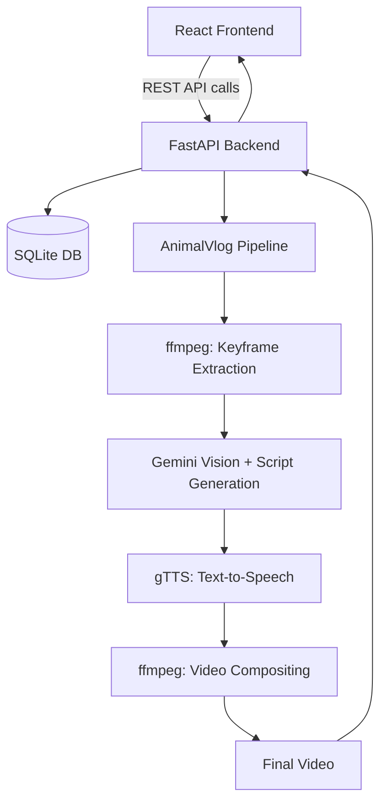
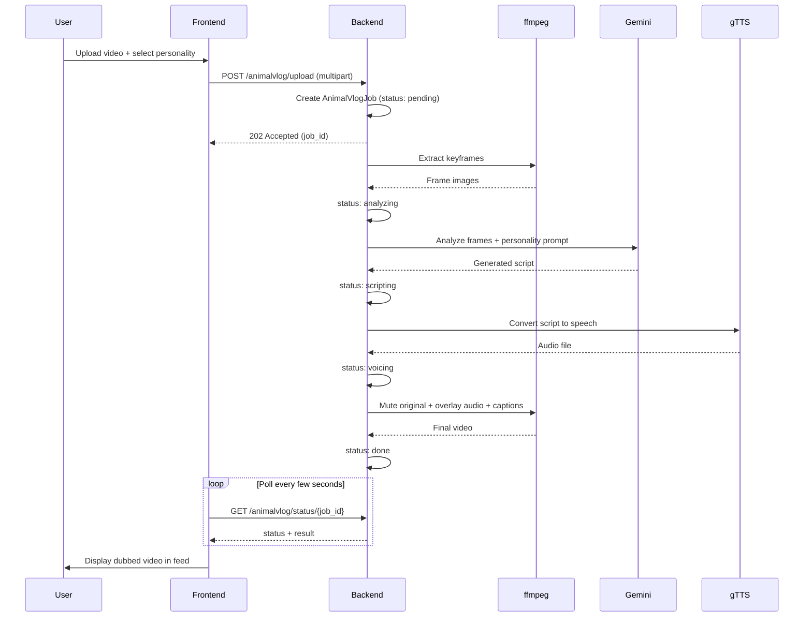

# e-മൃഗാലയം 🎯


## Basic Details
### Team Name: Useless4lyf


### Team Members
- Team Lead: Jayasankar Menon V - Model Engineering College
- Member 2: Devikrishna M K - Model Engineering College

### Project Description
e-മൃഗാലയം is a pet-only social media platform where animals can create profiles, share photos and videos, like posts, and leave comments. Its main feature, AnimalVlog, uses AI-generated personalities and voiceovers to turn pet videos into funny narrated clips.

### The Problem (that doesn't exist)
Animals everywhere are constantly photographed, filmed, and posted online without their permission. Pets are given social media accounts they cannot control, while stray, farm, and wild animals have no platform to share their experiences at all. The entire animal kingdom is forced to watch humans dominate the internet.

### The Solution (that nobody asked for)
e-മൃഗാലയം creates a social network for the entire animal kingdom. Pets, strays, farm animals, and even wild creatures can have digital profiles, share their adventures, express their personalities, and interact with other animals. With AnimalVlog, videos can receive hilarious AI-generated voices, finally letting every animal tell its own side of the story. 

## Technical Details
### Technologies/Components Used
For Software:
- Languages: JavaScript, Python, HTML, CSS
- Frontend: React, Vite, React Router
- Backend: FastAPI
- Database: SQLite with SQLAlchemy
- Libraries: Lucide React, Pydantic, Uvicorn, gTTS
- Tools: VS Code, Git, GitHub, uv, npm

For Hardware:
- No hardware components required

### Implementation
For Software:
# Installation

### Prerequisites

- Python 3.11 or newer
- Node.js 18 or newer and npm
- `uv`
- FFmpeg and FFprobe for AnimalVlog processing

On Ubuntu/Debian, install FFmpeg with:

```bash
sudo apt update
sudo apt install ffmpeg
```

### Backend

From the project root:

```bash
cd backend
uv sync
```

Create `backend/.env` and add your Gemini API key:

```env
GEMINI_API_KEY=your_gemini_api_key
FRONTEND_URL=http://localhost:5173
PROD=0
```

### Frontend

In a second terminal:

```bash
cd frontend
npm install
```

The frontend uses `http://localhost:8000` as the default backend URL. To use another backend URL, create `frontend/.env`:

```env
VITE_API_URL=http://localhost:8000
```

# Run

Start the backend in the first terminal:

```bash
cd backend
uv run uvicorn main:app --reload --host 0.0.0.0 --port 8000
```

Start the frontend in the second terminal:

```bash
cd frontend
npm run dev
```

Open the application at [http://localhost:5173](http://localhost:5173). The API is available at [http://localhost:8000](http://localhost:8000), and its interactive documentation is at [http://localhost:8000/docs](http://localhost:8000/docs).

For a production frontend build:

```bash
cd frontend
npm run build
npm run preview
```

### Project Documentation
For Software:

# Screenshots (Add at least 3)

*Add caption explaining what this shows*


*Add caption explaining what this shows*


*Add caption explaining what this shows*

# Diagrams

## System Architecture


*High-level architecture: the frontend talks to a FastAPI backend backed by SQLite, with uploaded videos routed through the AnimalVlog pipeline before the finished clip is posted back to the feed.*

## AnimalVlog Pipeline Flow


*Step-by-step flow of the AnimalVlog feature: the upload kicks off a background pipeline that moves through keyframe extraction, vision analysis, script generation, TTS, and compositing, with the frontend polling job status until the final dubbed video is ready.*
For Hardware:

# Schematic & Circuit

*Add caption explaining connections*


*Add caption explaining the schematic*

# Build Photos

*List out all components shown*


*Explain the build steps*


*Explain the final build*

### Project Demo
# Video
[Add your demo video link here]
*Explain what the video demonstrates*

# Additional Demos
[Add any extra demo materials/links]

## Team Contributions
- [Name 1]: [Specific contributions]
- [Name 2]: [Specific contributions]
- [Name 3]: [Specific contributions]

---
Made with ❤️ at TinkerHub Useless Projects 


